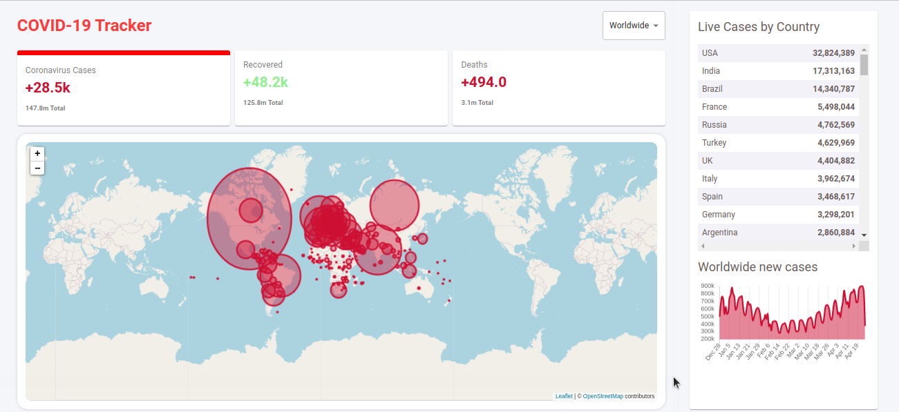

# react-covid-tracker
        # react-covid-tracker #
* this Web-App is devloped in React JS 
    
    -Frontend of this Project is desigend in react
    
    -Backend of this project is devloped in node js

    the count of covid casses is fetched from API [here](https://corona.lmao.ninja/docs/). 
    this data is first fetched from API in json fromat then its return as string. 
* Design of this WebApp

    
&nbsp;  
